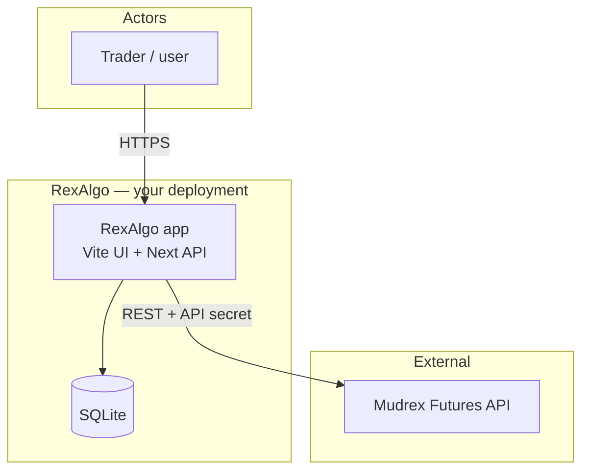
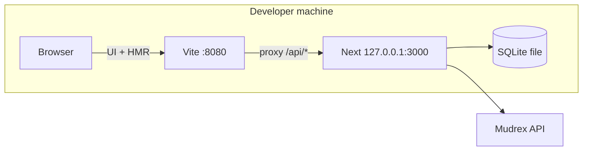
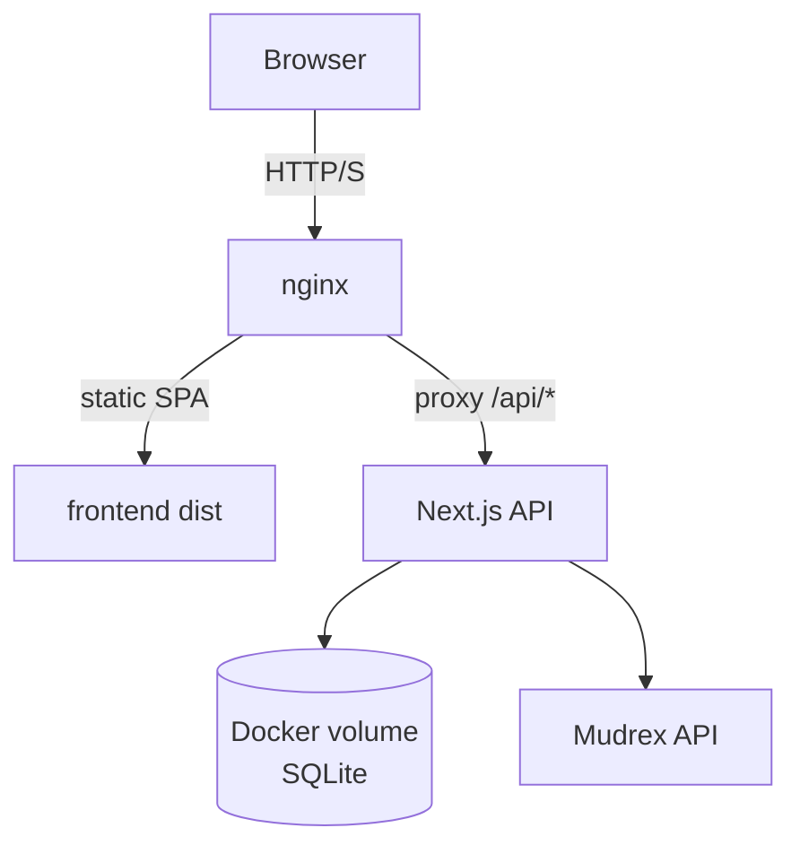
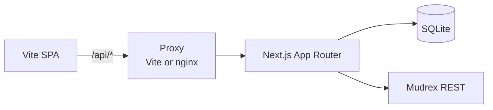
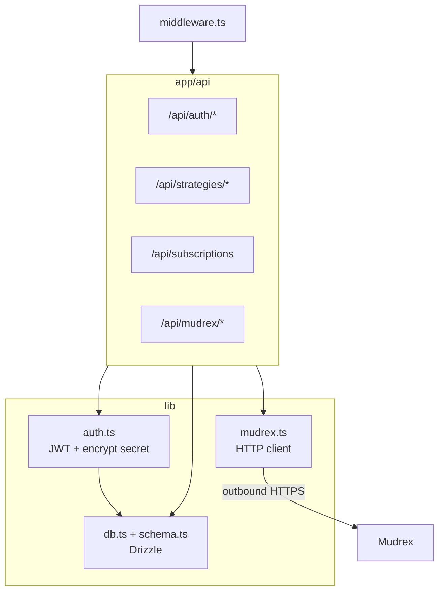
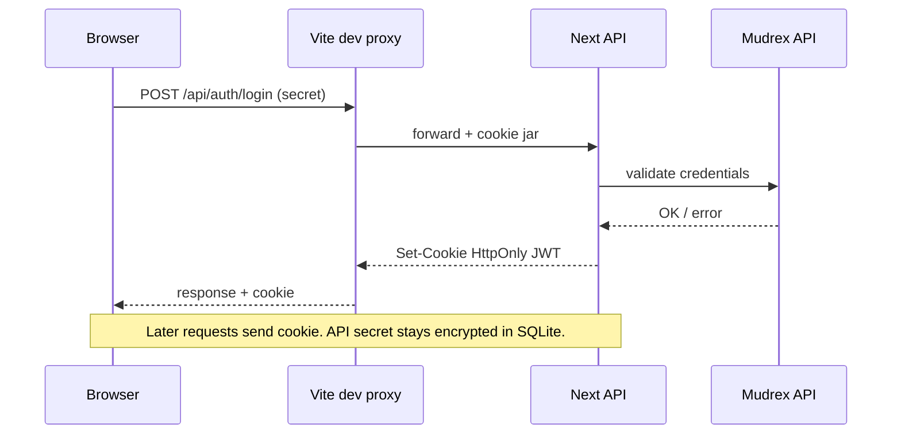
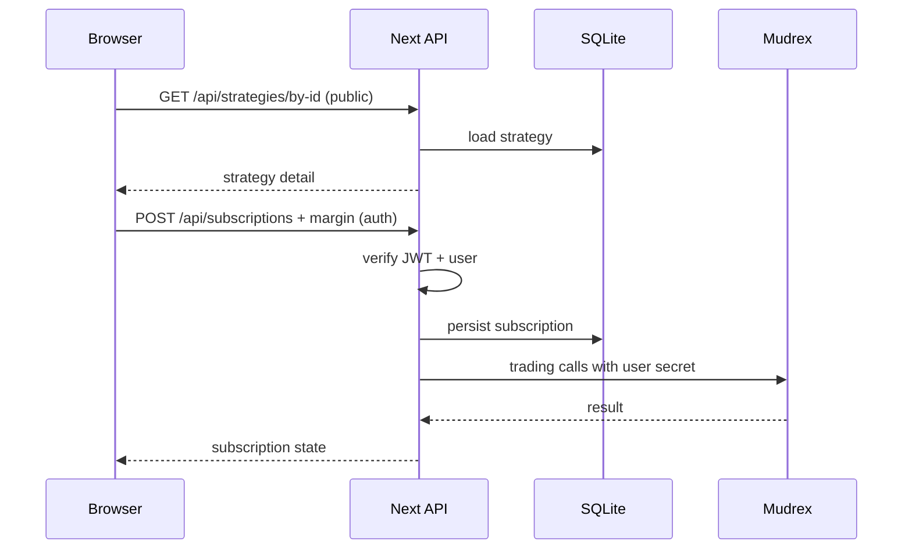

# RexAlgo

**RexAlgo** is a full-stack platform for **algorithmic strategies** and **copy trading**, built on the [**Mudrex Futures API**](https://docs.trade.mudrex.com/docs/overview). It pairs a premium **Vite + React** UI (shadcn, Tailwind) with a **Next.js** API, SQLite, and optional **Docker** deployment.

<p align="center">
  <a href="#quick-start">Quick start</a> ·
  <a href="#repository-layout">Layout</a> ·
  <a href="#architecture">Architecture</a> ·
  <a href="#development">Development</a> ·
  <a href="#docker-full-stack">Docker</a> ·
  <a href="#roadmap">Roadmap</a> ·
  <a href="#credits">Credits</a>
</p>

---

## Features

| Area | What you get |
|------|----------------|
| **Auth** | Connect with your **Mudrex API secret**; encrypted storage + JWT session |
| **Wallet / trading** | Spot & futures balances, transfers, positions, orders (via Mudrex) |
| **Algo marketplace** | Browse & subscribe to `algo` strategies with **margin per trade** |
| **Copy trading** | Browse `copy_trading` strategies, subscribe, same margin model |
| **Single UI** | All product screens live in **`frontend/`** (Lovable / Vite). **`backend/`** is API-only (+ tiny root status page). |

---

## Repository layout

```
RexAlgo/
├── frontend/          # Vite + React Router + shadcn (Lovable / rex-trader-playground lineage)
│   ├── src/lib/api.ts # HTTP client → /api (see file header)
├── backend/           # Next.js 16 — API only (no duplicate app UI)
│   ├── src/app/api/   # REST routes
├── repo/              # project.json (roadmap/stack), architecture.mmd (diagram source), ABOUT.txt
├── docker-compose.yml
├── package.json       # npm workspaces
├── CONTRIBUTING.md
├── SECURITY.md
└── LICENSE            # MIT
```

Structured metadata (roadmap, stack pointers): **`repo/project.json`**. Mermaid source (all diagrams): **`repo/architecture.mmd`**.

---

## Quick start

### 1. Clone & install

```bash
git clone https://github.com/DecentralizedJM/RexAlgo.git
cd RexAlgo
npm install
```

### 2. Backend env

```bash
cp backend/.env.example backend/.env.local
# Set JWT_SECRET and ENCRYPTION_KEY
```

### 3. Run both apps

```bash
npm run dev
```

| Open this | URL |
|-----------|-----|
| **Everything (UI + API)** | **[http://localhost:8080](http://localhost:8080)** |

**Vite** listens on **:8080** (your only tab). It **proxies `/api`** to Next on **127.0.0.1:3000** (wait until Next is up — `dev:web` uses `wait-on`). HMR stays on **8080**, so no extra proxy/gateway.

Sign in at **`/auth`** with your **Mudrex API secret**.

---

## Development

### Prerequisites

- **Node.js 20+**, **npm 10+**

### Install & run

From the repository root, `npm install` pulls **both** workspaces. Run:

```bash
npm run dev
```

| What | URL / notes |
|------|----------------|
| **Use in browser** | **http://localhost:8080** only (Vite + `/api` proxy) |
| **Next API** | **127.0.0.1:3000** — don’t open for normal use; must be running for `/api` |

**Workspace-only** (two URLs again — for debugging):

```bash
npm run dev -w @rexalgo/backend    # http://127.0.0.1:3000
npm run dev -w @rexalgo/frontend   # http://localhost:8080 + Vite proxy /api → 3000
```

### Backend environment

```bash
cp backend/.env.example backend/.env.local
```

Set `JWT_SECRET` and `ENCRYPTION_KEY`. Optional: `REXALGO_DB_PATH` for a custom SQLite path.

### Auth flow

1. Open the UI → **Connect** / **Auth**
2. Enter your **Mudrex API secret** (validated against [Mudrex Futures API](https://docs.trade.mudrex.com/docs/overview))
3. Session cookie is set for **localhost:8080**; Vite’s dev proxy forwards `/api` to Next (same origin)

### Troubleshooting

| Issue | Try |
|--------|-----|
| **401 on `/api/*` after login** | Use **http://localhost:8080**, not **127.0.0.1:3000** (cookies are for :8080) |
| **DB errors** | Ensure `REXALGO_DB_PATH` (if set) is writable |
| **Build failures** | Node 20+; run `npm install` from **repo root** (workspaces) |

---

## Architecture

RexAlgo is a **browser client**, an optional **reverse proxy**, **Next.js**, **SQLite**, and the **Mudrex REST API**. Diagrams render on GitHub; the same blocks live in **`repo/architecture.mmd`**.

### System context



### Development topology



### Production (Docker)



### Logical request path



### Backend modules



### Authentication sequence



### Strategy subscription sequence



### Stack summary

| Layer | Tech | Where |
|-------|------|--------|
| UI | Vite, React Router, shadcn, TanStack Query, Tailwind | `frontend/` |
| API | Next.js 16 App Router | `backend/src/app/` |
| Data | SQLite + Drizzle | `backend/src/lib/db.ts`, `schema.ts` |
| Execution | Mudrex REST | `backend/src/lib/mudrex.ts` |
| Session | JWT HttpOnly cookie + encrypted secret | `backend/src/lib/auth.ts`, `middleware.ts` |

---

## Docker (full stack)

```bash
cp .env.example .env
# Edit JWT_SECRET, ENCRYPTION_KEY. Optional: HOST_PORT=8080

docker compose up --build -d
```

Open **http://localhost** (or **http://localhost:8080** if `HOST_PORT=8080`).  
Nginx serves the UI and proxies **`/api`** to the API container. SQLite persists in volume **`rexalgo_data`**.

```bash
npm run docker:logs   # or: docker compose logs -f
npm run docker:down
```

---

## Scripts (root)

| Script | Description |
|--------|-------------|
| `npm run dev` | Next **127.0.0.1:3000** + Vite **:8080** (`wait-on` then UI) |
| `npm run build` | Build both workspaces |
| `npm run lint` | Lint frontend & backend (if configured) |
| `npm run docker:up` | `docker compose up --build -d` |

Workspace-only:

```bash
npm run dev -w @rexalgo/frontend
npm run dev -w @rexalgo/backend
```

---

## Roadmap

Priorities are **Mudrex-first**. Structured copy: **`repo/project.json`** → `roadmap`.

### Near term

| Item | Notes |
|------|--------|
| **Frontend lint clean pass** | Then remove `continue-on-error` for lint in `.github/workflows/ci.yml` |
| **CI hardening** | Optional `npm audit` reporting |
| **Env templates** | Keep `.env.example` / `backend/.env.example` in sync |

### Medium term

| Item | Notes |
|------|--------|
| **Webhook ingress** | Signed HTTP → validate → Mudrex actions |
| **Paper / dry-run mode** | Where API allows; clear UI state |
| **Rate limiting** | Login and sensitive `/api/*` routes |

### Longer term

| Item | Notes |
|------|--------|
| **Realtime updates** | WebSocket/SSE if Mudrex exposes streams |
| **Telegram / MCP** | Alerts; read-only agents first |
| **Observability** | Latency, Mudrex errors, structured logs |

### Out of scope (by default)

| Item | Reason |
|------|--------|
| **Non-Mudrex execution** | Intentional single-venue adapter; fork for other venues |
| **Incompatible copyleft in tree** | Conflicts with MIT unless maintainers approve |

---

## Policies & links

- **[CONTRIBUTING.md](CONTRIBUTING.md)** — PRs, Lovable workflow, licenses  
- **[SECURITY.md](SECURITY.md)** — secrets, hardening, disclosure  

---

## Disclaimer

RexAlgo is **not** official Mudrex software. Crypto futures trading involves **substantial risk**. No investment advice. Use at your own risk.

---

## License

MIT — see [LICENSE](LICENSE).
