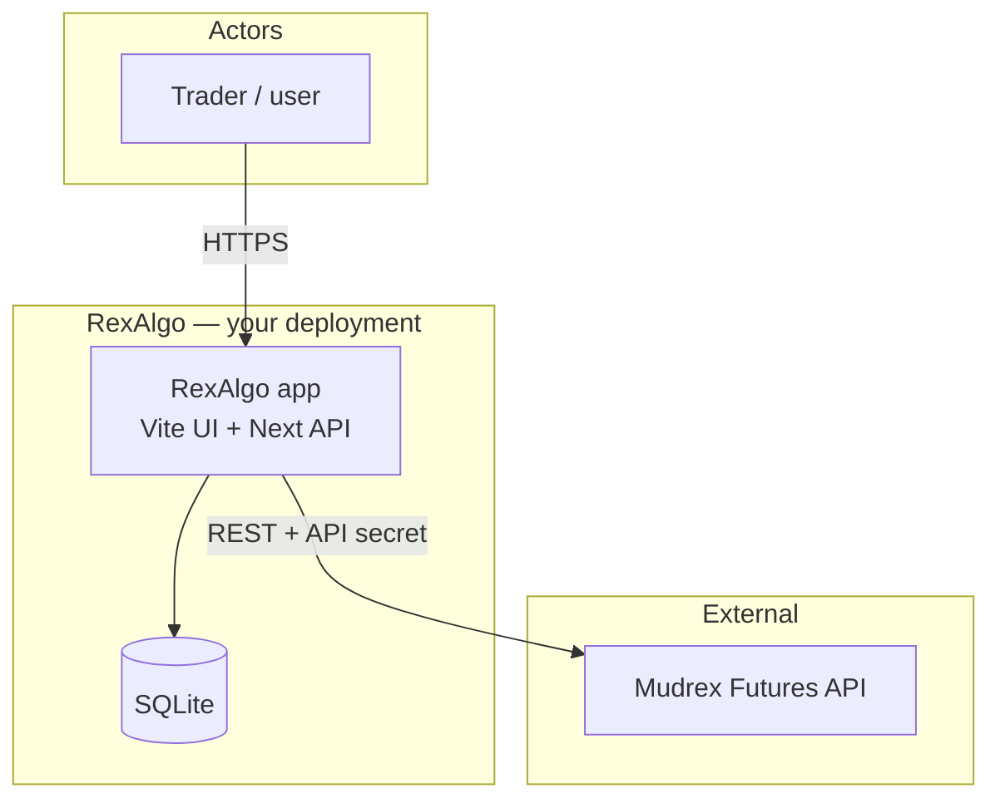
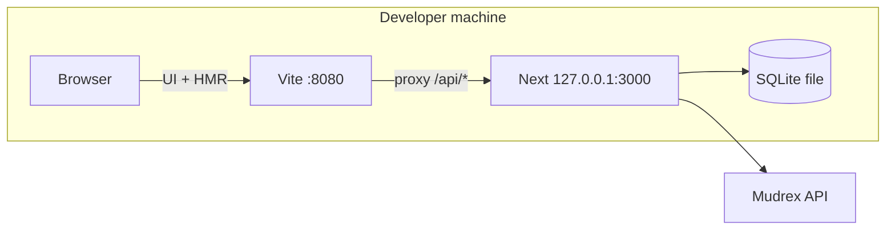
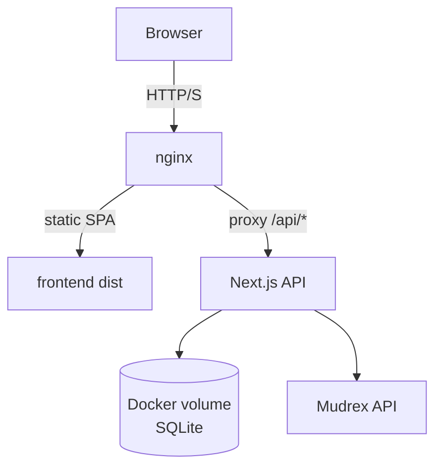
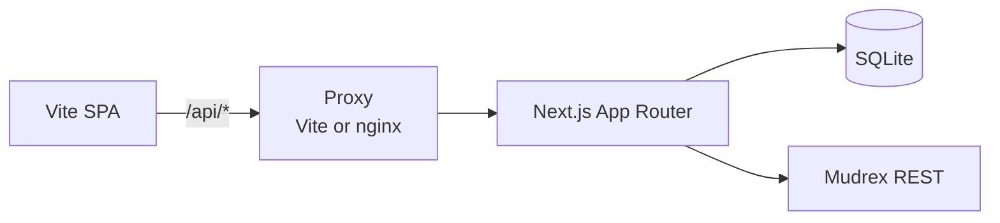
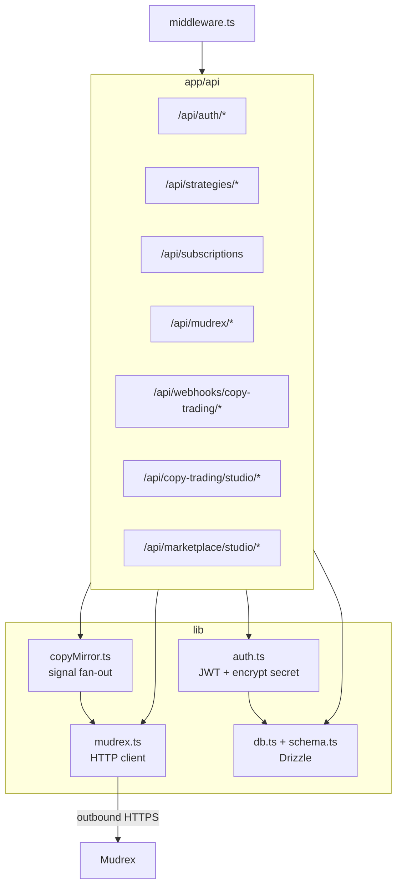
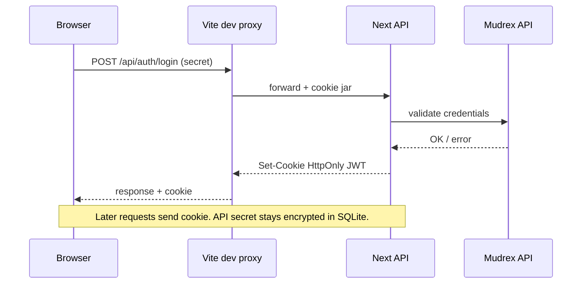
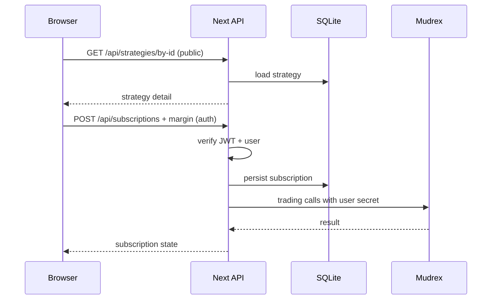

# RexAlgo

**RexAlgo** is a full-stack platform for **algorithmic strategies** and **copy trading**, built on the [**Mudrex Futures API**](https://docs.trade.mudrex.com/docs/overview). It pairs a premium **Vite + React** UI (shadcn, Tailwind) with a **Next.js** API, SQLite, and optional **Docker** deployment.

<p align="center">
  <a href="#quick-start">Quick start</a> ·
  <a href="#repository-layout">Layout</a> ·
  <a href="#hosting-railway-and-vercel">Hosting</a> ·
  <a href="#architecture">Architecture</a> ·
  <a href="#development">Development</a> ·
  <a href="#docker-full-stack">Docker</a> ·
  <a href="#roadmap">Roadmap</a> ·
  <a href="#credits">Credits</a>
</p>

---

## Features

| Area | What you get |
|------|----------------|
| **Auth** | Connect with your **Mudrex API secret**; encrypted storage + JWT session |
| **Wallet / trading** | Spot & futures balances, transfers, positions, orders (via Mudrex) |
| **Algo marketplace** | Browse & subscribe to `algo` strategies with **margin per trade** |
| **Strategy studio** | Masters create **algo** listings, **webhooks** (HMAC), pause/edit — **`/marketplace/studio`** |
| **Copy trading** | Browse `copy_trading` strategies, subscribe, same margin model |
| **Master studio** | Masters create **copy_trading** listings + **webhooks** — **`/copy-trading/studio`** |
| **Signal mirroring** | Signed `POST /api/webhooks/copy-trading/{strategyId}` → mirror **open/close** to subscribers via Mudrex |
| **Single UI** | All product screens live in **`frontend/`** (Lovable / Vite). **`backend/`** is API-only (+ tiny root status page). |

---

## Repository layout

```
RexAlgo/
├── frontend/          # Vite + React Router + shadcn (Lovable / rex-trader-playground lineage)
│   ├── src/lib/api.ts # HTTP client → /api (see file header)
├── backend/           # Next.js 16 — API only (no duplicate app UI)
│   ├── src/app/api/   # REST routes
├── repo/              # project.json (roadmap/stack), architecture.mmd (diagram source), ABOUT.txt
├── docker-compose.yml
├── docs/
│   └── DEPLOY.md      # Railway, Vercel, env checklist
├── package.json       # npm workspaces
├── CONTRIBUTING.md
├── SECURITY.md
└── LICENSE            # MIT
```

Structured metadata (roadmap, stack pointers): **`repo/project.json`**. Mermaid source (all diagrams): **`repo/architecture.mmd`**.

---

## Quick start (localhost)

End state: **one browser URL** (**127.0.0.1:8080**) for the UI; the API runs on **127.0.0.1:3000** behind Vite’s proxy.

### 1. Clone & install

```bash
git clone https://github.com/DecentralizedJM/RexAlgo.git
cd RexAlgo
npm install
```

### 2. Environment file (backend)

On the **first** `npm run dev`, the root **`predev`** script creates **`backend/.env.local`** from **`backend/.env.example`** if it does not exist.

**You must edit `backend/.env.local` before relying on auth or encryption in dev:**

| Variable | Required | Notes |
|----------|----------|--------|
| `JWT_SECRET` | **Yes** | Long random string (e.g. `openssl rand -hex 32`) |
| `ENCRYPTION_KEY` | **Yes** | Strong passphrase; used to encrypt Mudrex secrets & webhook signing secrets at rest |
| `PUBLIC_APP_URL` | Optional | No trailing slash. Full webhook URLs in **Master** / **Strategy** studio (use ngrok URL → port **3000** for external bots) |
| `REXALGO_SESSION_MAX_AGE_DAYS` | Optional | Browser session length (JWT + cookie), **1–90** (default **90**). Capped at Mudrex’s typical API key lifetime so the cookie doesn’t outlive a single key rotation. |
| `REXALGO_DB_PATH` | Optional | Custom SQLite file path (default: under `backend/`) |

```bash
# If you skipped dev and want to create the file manually:
cp backend/.env.example backend/.env.local
```

After changing secrets, **restart** `npm run dev`.

### 3. Run both apps

```bash
npm run dev
```

| Open this | URL |
|-----------|-----|
| **Everything (UI + API)** | **[http://127.0.0.1:8080](http://127.0.0.1:8080)** (recommended) |

**Prefer `127.0.0.1` over `localhost`:** browsers keep **separate cookie jars** for `localhost` vs `127.0.0.1`. If you use `http://localhost:8080`, the session cookie is shared with **every other tab** on `http://localhost:*`, which can break other local apps.

**Vite** listens on **:8080** (your only tab). It **proxies `/api`** to Next on **127.0.0.1:3000**. `dev:web` waits until **`GET /api/health`** returns **200** (so another random app on port **3000** won’t fool the dev script). HMR stays on **8080**. The session cookie is scoped to **`Path=/api`** so it is not sent to non-API paths on the same host.

Sign in at **`/auth`** with your **Mudrex API secret**.

**Session length:** The HttpOnly session cookie and JWT are issued together and expire after the same period (**default 90 days**, configurable with **`REXALGO_SESSION_MAX_AGE_DAYS`**, max **90**). There is **no sliding refresh**—when the JWT expires, the user signs in again with their API secret (same or newly rotated Mudrex key).

**Mudrex API key expiry (~90 days):** RexAlgo cannot extend Mudrex’s key lifetime. While your session JWT is valid, the app keeps using the encrypted secret from your last successful login. If Mudrex invalidates or rotates the key **before** the JWT expires, **Mudrex API calls** (wallet, orders, copy mirroring, etc.) return **401** with a clear error until the user **creates a new key in Mudrex** and **signs in again** at `/auth`. **Account id:** RexAlgo’s internal user id is derived from the API secret you used at login—**a different Mudrex key is a different RexAlgo user** (listings/subscriptions don’t carry over). To “refresh” the same key without changing identity, paste the **same** secret again before it expires, or sign in again after JWT expiry with the same key if Mudrex still accepts it. **`GET /api/auth/me`** returns **`sessionExpiresAt`** (ISO timestamp) for UI countdowns.

### 4. Verify the API (optional)

```bash
curl -s http://127.0.0.1:3000/api/health
# Expect JSON including "service":"rexalgo-api"
```

---

## Development

### Prerequisites

- **Node.js 20+**, **npm 10+**

### Install & run

From the repository root, `npm install` pulls **both** workspaces. Run:

```bash
npm run dev
```

| What | URL / notes |
|------|----------------|
| **Use in browser** | **http://127.0.0.1:8080** (Vite + `/api` proxy). Avoid `localhost` if you run other dev servers on `localhost` too. |
| **Next API** | **127.0.0.1:3000** — don’t open for normal use; must be running for `/api` |

**Workspace-only** (two URLs again — for debugging):

```bash
npm run dev -w @rexalgo/backend    # http://127.0.0.1:3000
npm run dev -w @rexalgo/frontend   # http://127.0.0.1:8080 + Vite proxy /api → 3000
```

### Backend environment

Same as [Quick start §2](#2-environment-file-backend). Reference: **`backend/.env.example`**.

- **`REXALGO_SESSION_COOKIE_PATH`** — default **`/api`** (cookie not sent on non-API paths).
- **`PUBLIC_APP_URL`** — prod API origin or **ngrok** tunnel to **Next :3000** so studio UIs show absolute webhook URLs.

### Copy trading (Master studio + webhooks)

1. Sign in → **Master studio** (`/copy-trading/studio`) → create a **copy_trading** strategy → **Enable webhook** and copy the **signing secret** (shown once).
2. Your bot runs **outside** RexAlgo (VPS, laptop, cloud). It `POST`s JSON signals to **`POST /api/webhooks/copy-trading/{strategyId}`** with header **`X-RexAlgo-Signature: t=<unix>,v1=<hex>`** where **`v1`** is **HMAC-SHA256** of **`${t}.${rawBody}`** (UTF-8) using the signing secret as the HMAC key (UTF-8 bytes of the secret string).
3. **Subscribers** (users who subscribed to that strategy in the app) get **mirrored** **open** / **close** actions on **their** Mudrex account via the API secret they stored at login. Sizing uses each subscriber’s **margin per trade** and the strategy’s **leverage**.
4. **Sign out vs mirroring:** **Signing out** only removes the **browser JWT cookie**. The server still has each user’s **encrypted Mudrex API secret** in SQLite. Webhook handling (`executeMirror`) loads subscribers from the DB and calls Mudrex with those secrets—it does **not** use the UI session. So **subscribed strategies keep mirroring after logout** as long as **Mudrex still accepts** each subscriber’s stored key. If a key expires, that subscriber’s mirrors fail until they **sign in again** with a new key (see banner in the app).
5. **Local dev**: external bots cannot reach `localhost`; use **ngrok** (or similar) to **`127.0.0.1:3000`** and set **`PUBLIC_APP_URL`** to the tunnel URL. Vite on **8080** is only for the browser; webhooks hit Next directly unless you add a proxy rule.

### Algo strategies (Strategy studio + webhooks)

1. Sign in → **Strategy studio** (`/marketplace/studio`) → create an **algo** listing → **Enable webhook** and copy the **signing secret** (shown once).
2. **Same** webhook endpoint and **HMAC** contract as copy trading: **`POST /api/webhooks/copy-trading/{strategyId}`** with **`X-RexAlgo-Signature: t=<unix>,v1=<hex>`** (HMAC-SHA256 of **`${t}.${rawBody}`**).
3. **Subscribers** use the marketplace → strategy detail → subscribe; **mirroring** to their Mudrex account works the same as for copy-trading strategies.
4. **`PUBLIC_APP_URL`** and **ngrok to :3000** apply the same way as in Master studio.

### Auth flow

1. Open the UI → **Connect** / **Auth**
2. Enter your **Mudrex API secret** (validated against [Mudrex Futures API](https://docs.trade.mudrex.com/docs/overview))
3. Session cookie (**`Path=/api`**) is set for the host you use (**`127.0.0.1:8080`** recommended); Vite’s dev proxy forwards `/api` to Next (same origin)

### Troubleshooting

| Issue | Try |
|--------|-----|
| **401 on `/api/*` after login** | Open the UI at **http://127.0.0.1:8080** (Vite), not **127.0.0.1:3000** (API only — no session from the SPA) |
| **Other localhost dev apps acting weird** | Use **127.0.0.1:8080** for RexAlgo, or clear site data for `localhost`. Cookies for `localhost` apply to **all ports** on that name. |
| **UI loads but `/api` fails / wrong responses** | Something else may be using **port 3000**. Run `curl -s http://127.0.0.1:3000/api/health` — you should see **`\"service\":\"rexalgo-api\"`**. If not, stop the other process or set **`VITE_API_PROXY_TARGET`** (frontend) and start Next on that port. |
| **`npm run dev` hangs before Vite starts** | RexAlgo API didn’t become healthy in time. Ensure **`npm run dev:api`** works (no **EADDRINUSE** on 3000) and **`/api/health`** returns JSON as above. |
| **DB errors** | Ensure `REXALGO_DB_PATH` (if set) is writable |
| **Build failures** | Node 20+; run `npm install` from **repo root** (workspaces) |

---

## Hosting: Railway and Vercel

**Yes — both work**, as long as the **browser** still calls **`/api` on the same hostname** as the UI (nginx reverse proxy or Vercel rewrites). That keeps the HttpOnly session cookie working (`SameSite=Lax`, `Path=/api`).

| Approach | UI | API |
|----------|-----|-----|
| **Railway (2 services)** | `frontend/Dockerfile` — set `API_UPSTREAM` to your API’s public URL | `backend/Dockerfile` — attach a **volume** on `/data` for SQLite |
| **Vercel + Railway** | Vite static on Vercel; rewrite `/api/*` → Railway (see `frontend/vercel.example.json`) | Same Next API on Railway |
| **Docker / VPS** | `docker compose up` (nginx already proxies `/api`) | Same compose file |

Full steps, env vars, and webhook notes: **[docs/DEPLOY.md](docs/DEPLOY.md)**.

---

## Architecture

RexAlgo is a **browser client**, an optional **reverse proxy**, **Next.js**, **SQLite**, and the **Mudrex REST API**. Diagrams render on GitHub; the same blocks live in **`repo/architecture.mmd`**.

### System context



### Development topology



### Production (Docker)



**Production checklist (before going live)**

| Item | Notes |
|------|--------|
| **Secrets** | Strong `JWT_SECRET` and `ENCRYPTION_KEY` (see `backend/.env.example`, root `.env.example` for Docker). Never use dev defaults. |
| **HTTPS** | Terminate TLS at nginx or your host; session cookies use `Secure` when `NODE_ENV=production`. |
| **Mudrex** | Live trading uses your real API secret; balances come from [Mudrex FAPI](https://docs.trade.mudrex.com/docs/quick-reference) (`GET /wallet/funds`, `POST /futures/funds`). |
| **CORS / origin** | Serve SPA and `/api` from the **same site** (nginx pattern in-repo) so cookies stay first-party. |
| **Ops** | Back up SQLite volume; monitor API errors; plan rate limits for public login (see [SECURITY.md](SECURITY.md)). |

### Logical request path



### Backend modules



### Authentication sequence



### Strategy subscription sequence



### Stack summary

| Layer | Tech | Where |
|-------|------|--------|
| UI | Vite, React Router, shadcn, TanStack Query, Tailwind | `frontend/` |
| API | Next.js 16 App Router | `backend/src/app/` |
| Data | SQLite + Drizzle | `backend/src/lib/db.ts`, `schema.ts` |
| Execution | Mudrex REST | `backend/src/lib/mudrex.ts` |
| Session | JWT HttpOnly cookie + encrypted secret | `backend/src/lib/auth.ts`, `middleware.ts` |

---

## Docker (full stack)

```bash
cp .env.example .env
# Set JWT_SECRET, ENCRYPTION_KEY (never use example values in production).
# Optional: HOST_PORT=8080 (avoids binding host :80 without sudo on many machines)
# Optional: PUBLIC_APP_URL=https://your-public-host (webhook URLs in studio)

docker compose up --build -d
```

Open **http://localhost** (or **http://localhost:8080** if `HOST_PORT=8080`).  
Nginx serves the UI and proxies **`/api`** to the API container. SQLite persists in volume **`rexalgo_data`**.

```bash
npm run docker:logs   # or: docker compose logs -f
npm run docker:down
```

---

## Scripts (root)

| Script | Description |
|--------|-------------|
| `npm run dev` | Runs **`predev`** (creates `backend/.env.local` from example if missing), then Next **127.0.0.1:3000** + Vite **:8080** (`wait-on` then UI) |
| `npm run build` | Build both workspaces |
| `npm run lint` | Lint frontend & backend (if configured) |
| `npm run docker:up` | `docker compose up --build -d` |

Workspace-only:

```bash
npm run dev -w @rexalgo/frontend
npm run dev -w @rexalgo/backend
```

---

## Roadmap

Priorities are **Mudrex-first**. Structured copy: **`repo/project.json`** → `roadmap`.

### Near term

| Item | Notes |
|------|--------|
| **Frontend lint clean pass** | Then remove `continue-on-error` for lint in `.github/workflows/ci.yml` |
| **CI hardening** | Optional `npm audit` reporting |
| **Env templates** | Keep `.env.example` / `backend/.env.example` in sync |

### Medium term

| Item | Notes |
|------|--------|
| **Paper / dry-run mode** | Where API allows; clear UI state |
| **Rate limiting** | Expand beyond webhook route; login and sensitive `/api/*` routes |
| **Strategy performance** | Auto **PnL / win rate** from Mudrex with clear attribution rules |

### Longer term

| Item | Notes |
|------|--------|
| **Realtime updates** | WebSocket/SSE if Mudrex exposes streams |
| **Telegram / MCP** | Alerts; read-only agents first |
| **Observability** | Latency, Mudrex errors, structured logs |

### Out of scope (by default)

| Item | Reason |
|------|--------|
| **Non-Mudrex execution** | Intentional single-venue adapter; fork for other venues |
| **Incompatible copyleft in tree** | Conflicts with MIT unless maintainers approve |

---

## Policies & links

- **[CONTRIBUTING.md](CONTRIBUTING.md)** — PRs, Lovable workflow, licenses  
- **[SECURITY.md](SECURITY.md)** — secrets, hardening, disclosure  

---

## Disclaimer

RexAlgo is **not** official Mudrex software. Crypto futures trading involves **substantial risk**. No investment advice. Use at your own risk.

---

## License

MIT — see [LICENSE](LICENSE).
