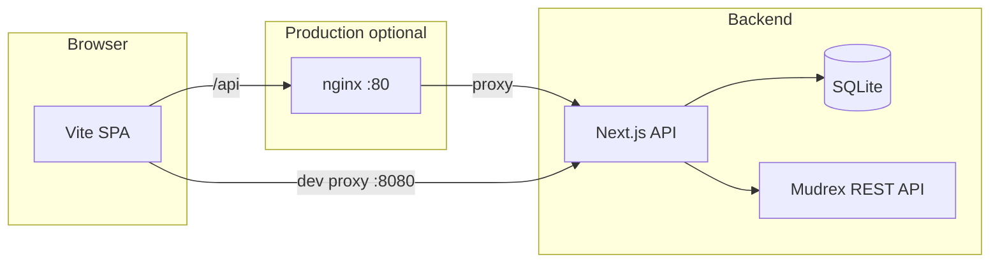

# Architecture

## Frontend (`frontend/`)

- **Vite** + **React Router** + **shadcn/ui** + **Tailwind**
- **TanStack Query** for server state
- **`src/lib/api.ts`** — `fetch("/api/...")` with `credentials: "include"`
- Premium UI originated from **Lovable** ([rex-trader-playground](https://github.com/DecentralizedJM/rex-trader-playground) lineage)

## Backend (`backend/`)

- **Next.js 16** App Router
- **SQLite** + **Drizzle ORM** — users, strategies, subscriptions, trade logs
- **Mudrex** — wallet, assets, orders, positions, leverage (`src/lib/mudrex.ts`)
- **Auth** — JWT in HttpOnly cookie; API secret encrypted at rest (`src/lib/auth.ts`)

## Data flow (subscribe)

1. User opens strategy detail → `GET /api/strategies/:id` (public)
2. User confirms margin → `POST /api/subscriptions` (authenticated)
3. Execution against Mudrex uses the user’s stored secret on the server when calling protected Mudrex routes

## Related docs

- [Mudrex API overview](https://docs.trade.mudrex.com/docs/overview)
- Unofficial Python SDK reference: [mudrex-api-trading-python-sdk](https://github.com/DecentralizedJM/mudrex-api-trading-python-sdk)
