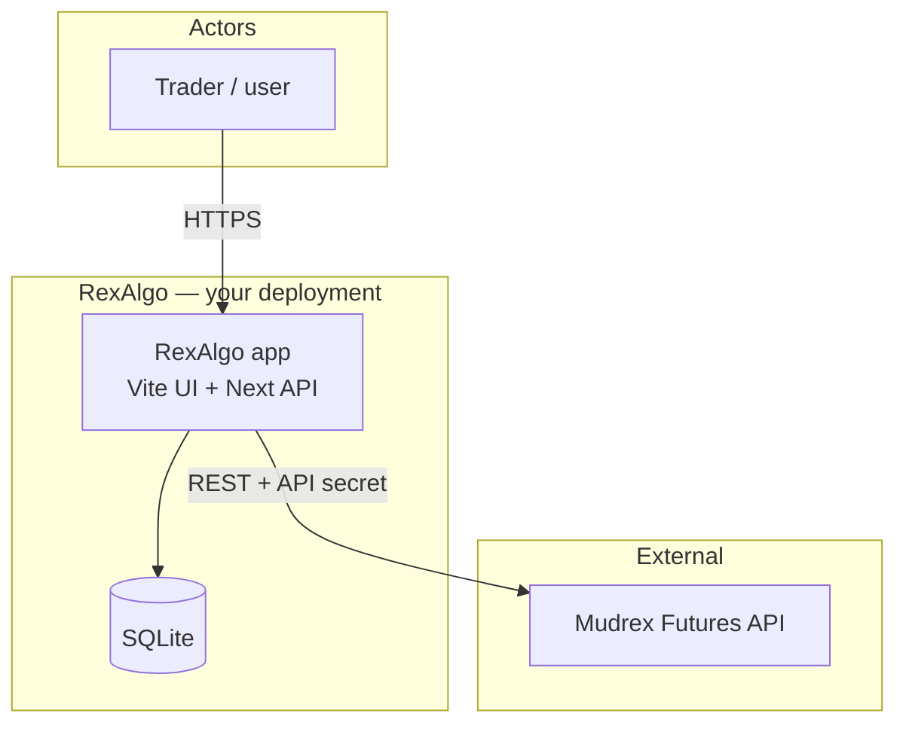
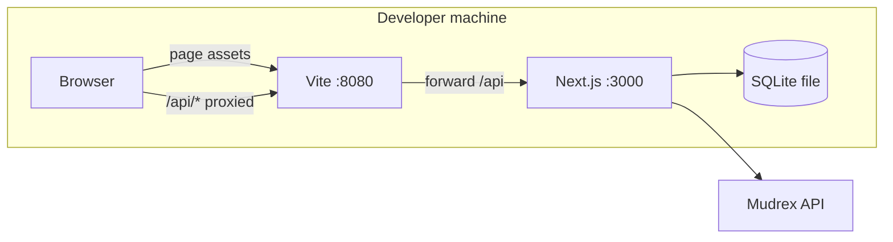
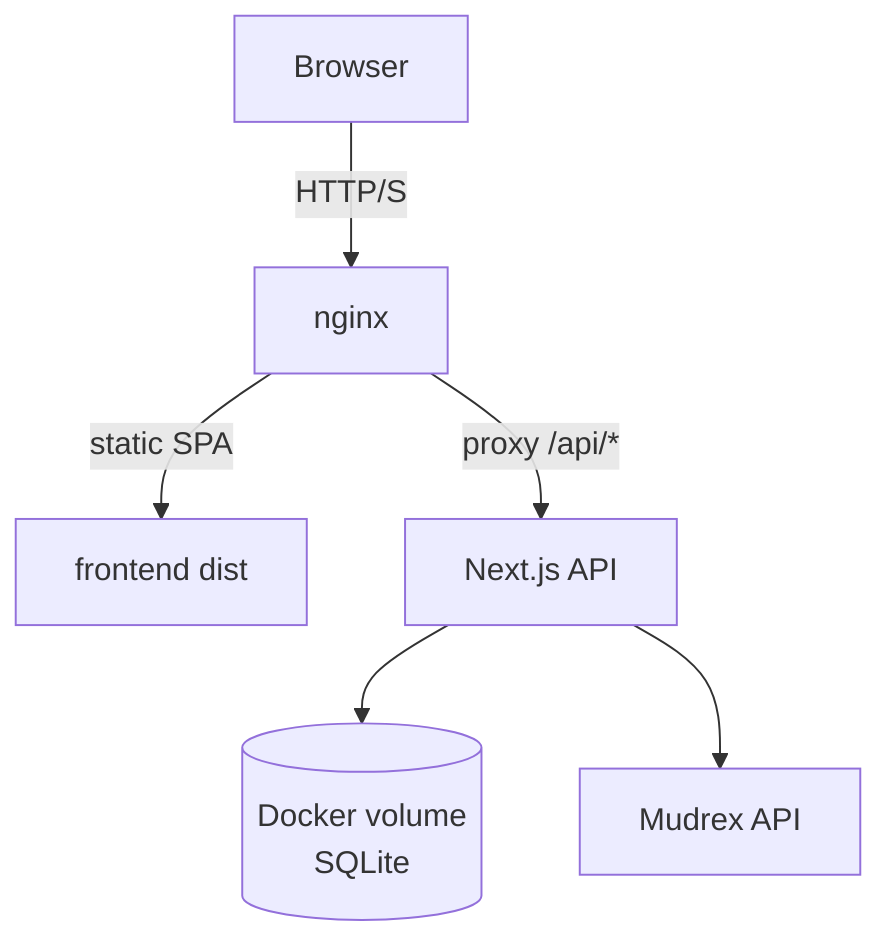
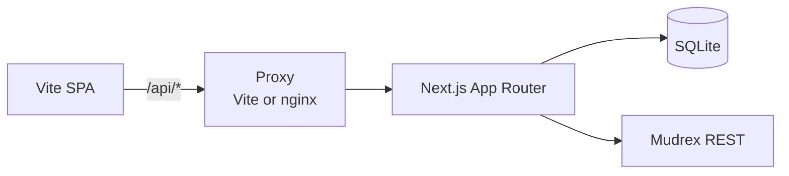
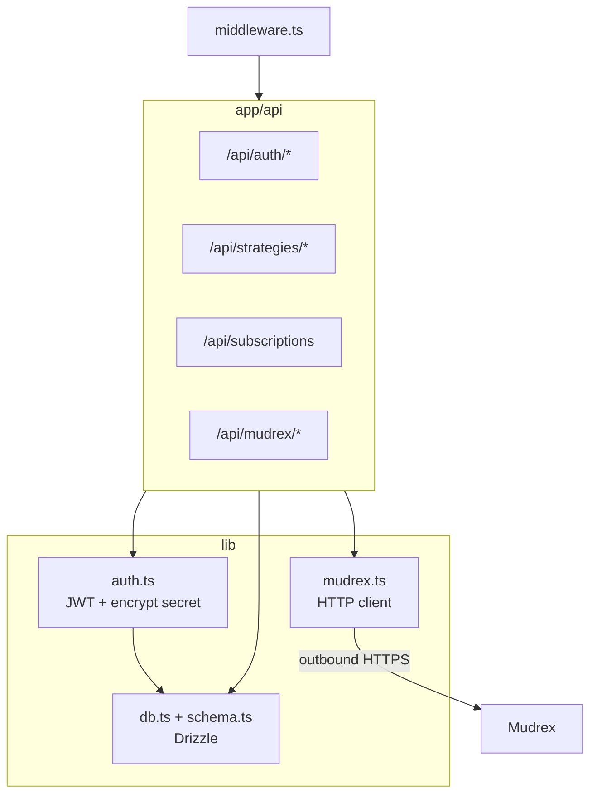
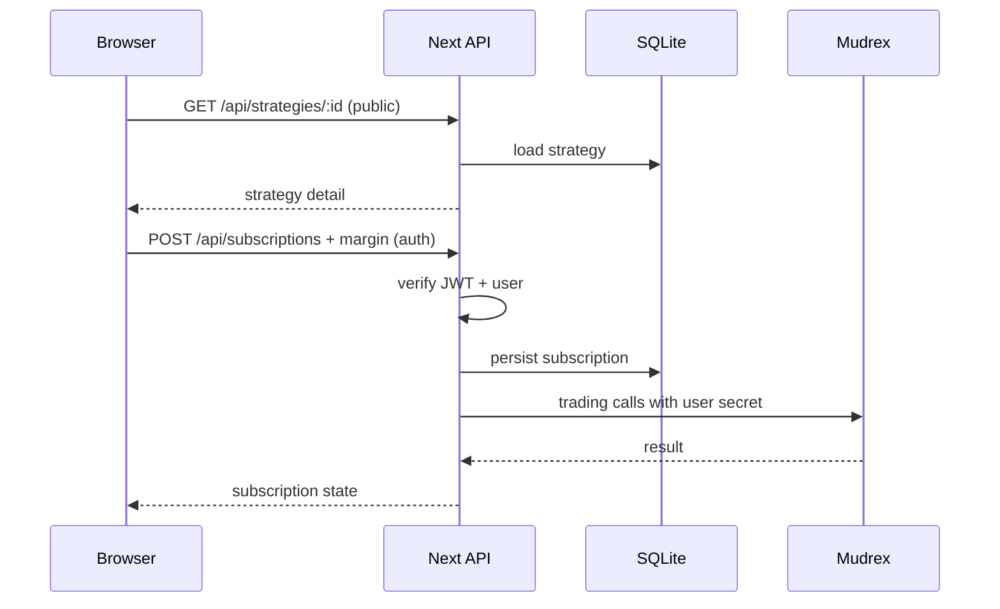

# Architecture

RexAlgo is a **browser client**, an optional **reverse proxy**, a **Next.js backend**, a **local SQLite database**, and the **Mudrex REST API**. Diagrams use [Mermaid](https://mermaid.js.org/) (renders on GitHub and many Markdown viewers).

---

## 1. System context

Who talks to what at the highest level.



---

## 2. Runtime topology (dev vs production)

### Development

Vite and Next run as **two processes**. The UI origin is **:8080**; Vite proxies `/api` to Next on **:3000** so session cookies stay same-origin for the browser.



### Production (Docker Compose)

Nginx serves the **static** frontend and **reverse-proxies** `/api` to the API container. SQLite lives in a **named volume**.



---

## 3. Request path (logical)

Same logical path in dev (via Vite) and prod (via nginx).



---

## 4. Backend structure (modules)



---

## 5. Authentication sequence

```mermaid
sequenceDiagram
  participant B as Browser
  participant V as Vite :8080
  participant N as Next API
  participant M as Mudrex API

  B->>V: POST /api/auth/login (secret)
  V->>N: forward + cookie jar
  N->>M: validate credentials
  M-->>N: OK / error
  N-->>V: Set-Cookie HttpOnly JWT
  V-->>B: response + cookie
  Note over B,N: Later requests include cookie; secret stored encrypted in SQLite
```

---

## 6. Strategy subscription flow



---

## Frontend (`frontend/`)

- **Vite** + **React Router** + **shadcn/ui** + **Tailwind**
- **TanStack Query** for server state
- **`src/lib/api.ts`** — `fetch("/api/...")` with `credentials: "include"`
- UI lineage: **Lovable** / [rex-trader-playground](https://github.com/DecentralizedJM/rex-trader-playground)

## Backend (`backend/`)

- **Next.js 16** App Router
- **SQLite** + **Drizzle ORM** — users, strategies, subscriptions, trade logs
- **Mudrex** — wallet, assets, orders, positions, leverage (`src/lib/mudrex.ts`)
- **Auth** — JWT in HttpOnly cookie; API secret encrypted at rest (`src/lib/auth.ts`)

## Planned extensions

See [ROADMAP.md](./ROADMAP.md): webhooks, paper/dry-run, rate limiting, realtime, observability.

## Related docs

- [Mudrex API overview](https://docs.trade.mudrex.com/docs/overview)
- Unofficial Python SDK: [mudrex-api-trading-python-sdk](https://github.com/DecentralizedJM/mudrex-api-trading-python-sdk)
